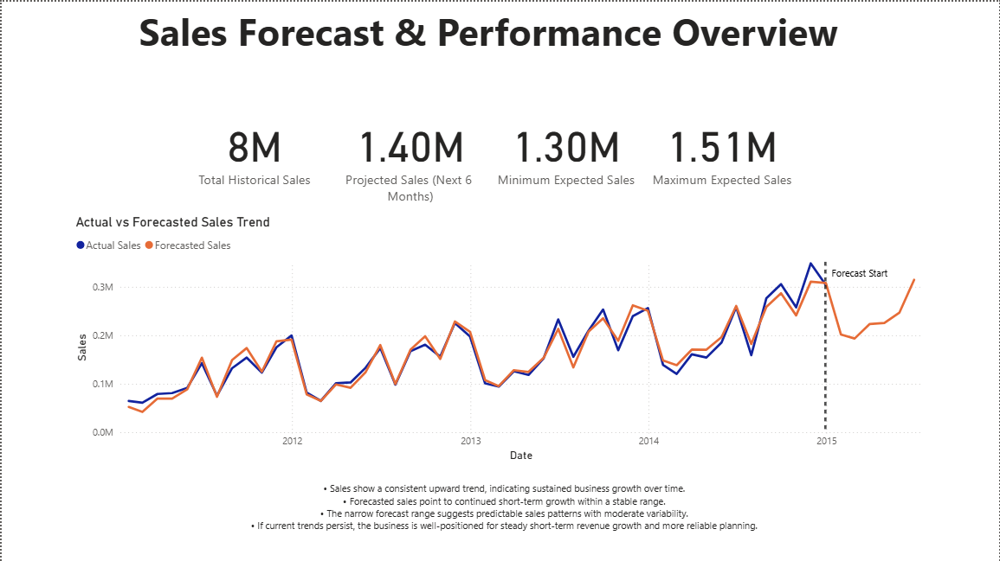
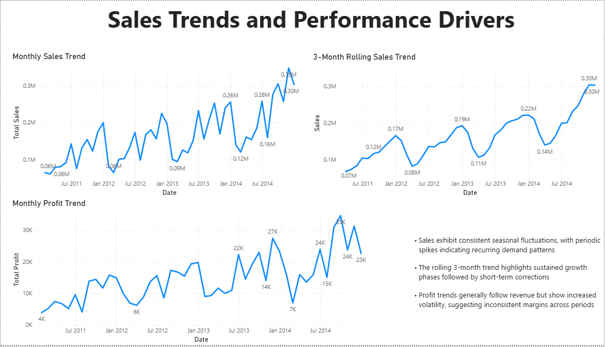

# Retail Sales Forecasting & Trend Analysis

Forecasted retail sales trends using Python to support inventory planning, staffing, and business decision-making.

## Project Summary

Analyzed historical retail sales data and built a time series forecasting model to predict the next 6 months of performance.

Key findings:
- Sales show consistent upward growth with clear seasonal demand patterns
- Forecast indicates stable short-term growth within a predictable range
- Peak sales periods can be anticipated for better planning
- Profit is more volatile than sales, highlighting margin instability

Business impact:
- Enables proactive inventory and staffing decisions
- Helps align marketing with high-demand periods
- Supports better financial planning through forward-looking insights

## Dashboard Highlight

The forecast closely follows historical trends with clear seasonal patterns, 
indicating stable short-term growth and predictable demand cycles.

  

## Case Study

[Retail Sales Forecasting Case Study](case_study.pdf)

## Key Insights

- Sales trend upward over time with consistent growth patterns
- Clear seasonality with recurring demand spikes during peak periods
- Forecast shows stable growth with no major short-term declines
- Profit is less stable than revenue, indicating margin variability
- Rolling averages confirm sustained growth with short-term fluctuations

## Project Overview

This project simulates a real-world forecasting workflow by transforming transactional data into a monthly time series and building a predictive model.

Workflow:
- Cleaned and validated raw data using Python
- Aggregated transactional data into monthly metrics
- Built a forecasting model using Prophet
- Generated a 6-month sales forecast
- Visualized trends and predictions in Power BI

## Data Preparation

- Validated date formats, numeric fields, and missing values
- Aggregated transaction-level data to monthly level
- Created key metrics:
  - Total sales
  - Total profit
  - 3-month rolling sales trend
  - 3-month rolling profit trend

## Forecasting Approach

- Built a time series forecasting model using Prophet
- Generated a 6-month forward-looking sales prediction
- Created datasets for:
  - Monthly sales time series
  - Forecast outputs
  - Actual vs forecast comparison

## Dashboard Features

- Historical vs forecasted sales comparison
- Actual vs predicted trend visualization
- Monthly sales and profit trends
- Rolling average trend analysis
- Seasonality insights and performance patterns

## Business Recommendations

- Use forecasts to guide inventory and staffing decisions
- Align marketing campaigns with seasonal demand peaks
- Monitor profit volatility to improve margin consistency
- Continuously retrain the model with new data to maintain accuracy

## Tools Used

- Python (Pandas, Prophet)
- Power BI

## Dataset

Monthly aggregated retail sales data derived from transactional orders

## Project Structure

retail-sales-forecasting/  
├── 01_data_source/  
├── 02_python/  
├── 03_analysis_output/  
├── 04_forecasting/  
├── 05_powerbi/  
├── 06_screenshots/  
├── case_study.pdf  
└── README.md
